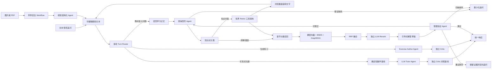

# 初中数学错题智能问答系统 | Agentic RAG、LangGraph 与自动化评测

面向初中数学错题订正的 Agentic RAG 系统，重点解决公式检索不稳定、单一向量召回遗漏步骤，以及生成答案缺少依据验证的问题。系统以教材知识片段为事实边界，输出可订正、可追问、带引用且经过验证的分步解答。

## 为什么选择 LangGraph

LangChain 适合组合线性 Chain，但错题订正需要显式保留“多轮意图、确定性基线、改写后的题目、知识点分类、召回结果、验证问题和对话历史”。因此项目使用 LangGraph 构建 Workflow + Agent 混合架构：每轮先经过 Turn Router；可形式化题先生成可验证基线，再强制经过 LLM Tutor Agent 与独立 Critic；需要教材语义的问题进入 Agentic RAG；练习题进入 Author Agent 与独立 Critic。



图片/PDF 先进入 `math.multimodal@1.0.0`：文件签名、体积、页数与像素安全校验后，视觉 Agent 只转写题干、公式、选项、图形标注和学生作答，不负责解题。语音在浏览器内转成可编辑文字。两种结果都必须由用户核对，点击发送后才进入统一的 `math.correction@1.0.0` Workflow、Turn Router、RAG 和独立 Critic。

## 核心实现

### 三阶段检索

1. 分类召回：将问题改写、分解为多条子 Query，按年级、章节、知识点、题型和错误分类缩小候选集。
2. 多路融合：`BAAI/bge-m3` 稠密向量与数学符号感知 BM25 双检索，并由轻量 GraphRAG 补充前置知识；使用 RRF 融合多 Query、多索引排名。
3. 精排过滤：独立 LLM-Rerank 检查公式条件、年级和步骤支撑力，只把 Top-K 带来源片段交给生成 Agent。

入库阶段保护 LaTeX 和常见公式不被切断：两条及以上公式的密集段使用约 280 token，单公式段约 380 token，概念文本约 700 token。每个 Chunk 携带公式 ID、前置知识点和业务元数据，并同步维护知识点依赖图谱。

### 查询改写与验证

查询改写 Agent 会把“这题怎么做”“上一步为什么变号”等口语问题转成规范数学表述，保留原始公式、数字、单位和图形关系，并从多轮历史中解析代词。题设不足时不会臆造条件，而是进入追问。

生成答案固定包含知识点定位、解题思路、分步过程、最终答案和自检。确定性题的 LLM 讲解必须与数学基线逐项一致；RAG 答案则与题设、教材片段和引用编号交叉检查。失败后先进入修复 Agent 和二次 Critic，仍不通过时只保留有证据的结论并追问一个具体条件，不显示内部拒绝文案。

Critic 与生成模型使用独立实例，组合教材事实忠实度检查与 SymPy 确定性数学校验，输出结构化缺陷报告，不让生成 Agent 自审。

### 运行时约束与 Skill

- Pydantic Schema 约束解析、改写、分类、重排和 Critic 输出。
- 工具白名单、24 步全局预算、8 步 ReAct 预算和 180 秒准确性优先上限；单次模型调用最多 45 秒且 SDK 不自动重试，Critic 失败不会启动无界循环。
- `question_parse_skill`、`math_retrieval_skill`、`similar_exercise_skill`、`answer_verify_skill` 同时提供 LangGraph Tool-Calling 与 MCP 2.1 stdio 接口。
- 全链路 JSONL Trace 记录节点、工具摘要、Critic 结果、延迟与 Token 指标；失败 case 单独进入待复现集合。
- 检索与静态资源可以缓存；最终问答响应在 `FORCE_LLM_EVERY_TURN=true` 时不读取缓存，保证每道数学题实际经过模型推理。
- `metrics.model_attempts/model_successes/model_failures` 分开记录模型尝试、成功返回和失败；兼容字段 `tool_calls` 只等于成功返回数，前端不会再把确定性回退伪装成模型参与。

### 对话与三级记忆

系统维护本轮工作记忆、会话多轮记忆和长期薄弱知识点记忆；上下文超限时压缩摘要。长期记忆只保存可复用的错因、知识缺口与讲解偏好，不保存一次性完整答案。

## 自动化评测

产品化风险、发布边界和 bad-case 生命周期见 `docs/Product_Readiness.md`；可执行注册表位于 `evaluation/bad_case_registry.json`。高频可形式化题的确定性数学内核保持 P95 100 ms 门禁，但生产回答仍经过 Tutor Agent 与 Critic；整条请求采用 180 秒上限，以答案准确性优先，模型不可用时退回已验证基线或有教材证据的回答并登记失败轨迹。

`evaluation/math_benchmark_1000.csv` 包含 1000 条可审计标注题目：334 条普通样例、333 条幻觉高危样例、333 条口语化样例，覆盖七至九年级代数、几何、函数和统计与概率。独立评测脚手架支持策略 A/B、回归报告、RAGAS 与质量门禁，跟踪：

- RAGAS：`Context Precision`、`Context Recall`、`Faithfulness`、`Answer Relevance`。
- 业务指标：错因诊断准确率、步骤正确性、知识点匹配准确率、直接答案违规率和幻觉检出率。
- 工程指标：Recall@K、平均工具调用数、失败率、端到端延迟和 Token 消耗。

`evaluation/reports/formal-evaluation-20260902.json` 汇总当前可核验的真实评测：
C-Eval 中学数学公开 val 全量、GSM8K 官方 test 全量、SciFact 与 CovidRetrieval
官方完整检索任务，以及 PRM800K 300 条人工步骤标签与同批 RAGAS。报告保留空预测、
数据集 revision、任务规模和适用边界；公开题准确率、检索指标、RAGAS 与错因定位
指标不会合并成一个分数。完整说明与复现命令见 `evaluation/README.md`。

`evaluation/benchmark_history.json` 保存项目历史口径：双检索 Recall 提升 15%、幻觉率 `35% -> 10%`、Answer Relevance `0.50 -> 0.78`，以及方案被导师采纳并用于校企合作项目。该文件已标记 `verified_in_current_workspace_run: false`，这些数字不是本次环境复测结果；模型、Prompt 或知识库变化后必须重新跑全量评测。

本次仓库冒烟只跑了 10 条检索 A/B：三种策略 Context Recall 均为 `0.9667`，小样本未观察到 Recall lift，结果位于 `evaluation/reports/smoke_*.csv`。

## 快速开始

```powershell
python -m venv .venv
.venv\Scripts\activate
pip install -r requirements.txt
Copy-Item .env.example .env
```

填写 `.env` 后构建数学知识库并启动 CLI：

```powershell
python ingest.py
python main.py
```

默认示例配置使用 Tosky.ai 的 OpenAI-Compatible Responses API：`gpt-5.6-sol`、`reasoning.effort=low`、`store=false`。低推理强度适合日常初中题并显著降低等待时间；复杂证明题可在 `.env` 中临时改为 `high`。需要在 `.env` 的 `OPENAI_API_KEY` 中配置该服务可用的密钥；不要提交真实密钥。

生产前端使用 React 19、TypeScript、Vite 7、Tailwind CSS 4、TanStack Query、Zustand、Radix UI、Motion、React Markdown 和 KaTeX。首次启动或修改前端后先构建静态资源：

```powershell
cd frontend
npm install
npm run typecheck
npm run build
cd ..
```

前端开发时可运行 `npm run dev`，Vite 默认监听 `http://127.0.0.1:5173/`；生产访问仍由 FastAPI 统一提供。启动 FastAPI（`/ask`、`/attachments/parse`、`/feedback`、`/health`、`/ready`、不暴露密钥的 `/runtime`，以及受保护的 `/metrics`）：

```powershell
uvicorn app:app --reload --port 8000
```

`/metrics` 默认不暴露。仅在服务进程环境中设置非空 `OPERATIONS_METRICS_TOKEN` 后启用，并要求请求携带 `Authorization: Bearer <token>`；未配置或凭据不匹配时统一返回 `404`。

普通用户打开 `http://127.0.0.1:8000/` 使用双语学生端，默认中文，可在右上角切换 English；`/docs` 是供开发者调试接口的 Swagger 页面。可以直接输入题目、上传清晰的 JPG/PNG/WebP 或文本 PDF，也可以点击“语音输入”把口述内容转成文字。上传和语音都只填写可编辑输入框，不会自动求解；先核对数字、正负号、上下标和图形条件，再补充错误作答并点击发送。收到分析后可在同一输入框继续追问。

语音输入依赖浏览器的 `SpeechRecognition` 能力和麦克风权限；不支持该能力的浏览器会显示明确提示，仍可使用键盘或上传。当前可靠边界是清晰印刷图片和带文本层的 PDF；潦草手写、扫描 PDF 与复杂几何图必须人工核对和补充条件。

视觉转写使用独立的 `ATTACHMENT_LLM_CALL_TIMEOUT_SECONDS`，默认 45 秒；附件 Skill 和接口总预算分别为 50 秒与 70 秒。普通问答的 `LLM_CALL_TIMEOUT_SECONDS` 默认为 45 秒，整条 Workflow 最多等待 180 秒，前端最多等待 185 秒。学生端不再要求选择“讲解/找错因/出题”，每条输入统一进入 Turn Router；顶部显示模型连接状态，回答和证据抽屉显示实际 attempts、successes、执行路径与 trace。

启动 MCP stdio 服务；本地模型已经缓存时可开启离线模式，避免启动时访问 Hugging Face：

```powershell
$env:HF_HUB_OFFLINE="1"
python mcp_server.py
```

容器化启动：

```powershell
docker compose up --build
```

数据校验、检索 A/B、端到端评测与质量门禁：

```powershell
python evaluation/evaluation.py --mode validate
python evaluation/bad_case_harness.py --report
python evaluation/evaluation.py --mode ab --limit 100 --version dev
python evaluation/evaluation.py --mode e2e --limit 100 --skip-ragas --version dev
python evaluation/evaluation.py --mode gate
```

完整 E2E/RAGAS 评测会向 `.env` 配置的模型端点发送题目与检索上下文并产生费用；`--limit 0` 表示全量 1000 条。

## 项目结构

```text
agentic_rag/
  graph.py               # Workflow + Agent 混合状态图
  pipelines/             # 订正、附件解析等版本化 YAML Pipeline
  skills/                # 可独立测试和观测的版本化业务 Skill
  nodes.py               # 解析、改写、检索、重排、生成、Critic 节点
  react_agent.py         # 有界 ReAct Tool-Calling
  math_retriever.py      # Dense + BM25 + GraphRAG + RRF
  knowledge_graph.py     # 轻量知识点依赖图谱
  math_taxonomy.py       # 数学分类、公式分块与 BM25 分词
  math_validation.py     # SymPy 确定性校验
  memory_manager.py      # 三级记忆与上下文压缩
  skills.py              # 白名单业务 Skill
  tracing.py             # Trace、预算与 bad case
  metrics.py             # Prometheus 指标
data/
  初中数学核心知识.md      # 示例教材依据
  knowledge_graph.json    # 入库生成的 GraphRAG 图谱
evaluation/
  math_benchmark_1000.csv # 1000 条标注集
  evaluation.py           # A/B、E2E、RAGAS、质量门禁
  generate_dataset.py     # 确定性数据集生成/校验
frontend/                  # React 19 + TypeScript + Vite 7 学生端
app.py                    # FastAPI 与反馈入口
mcp_server.py             # MCP 2.1 stdio 服务
ingest.py
main.py
Dockerfile
docker-compose.yml
```

## 技术关键词

LangGraph · Agentic RAG · Query Rewrite · Dense + BM25 · RRF · GraphRAG · LLM-Rerank · Critic Agent · Tool-Calling · MCP · Memory · RAGAS · Trace · Docker Compose
