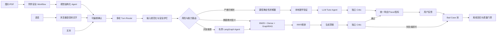

# 初中数学错题问答系统：产品化设计与 Bad-Case 治理

## 1. 产品边界

系统面向七至九年级数学题、学生错误步骤诊断、引导式订正、相似练习和连续追问。文本、清晰印刷图片、文本 PDF 与浏览器语音转写统一落入可编辑题目文本；用户确认后才进入正式订正 Workflow。每个数学题都调用 LLM，但不让 LLM 独占数学真值：可形式化题先由本地课程求解器生成基线，再由 Tutor Agent 讲解并由独立 Critic 核对；需要教材语义的题进入混合检索、生成 Agent 与 Critic；任何未验证结论均不得伪装成正确答案。

当前“生产可用”定义限定为单用户、本地或受信网络，以及用户确认后的题目文本。清晰印刷图片和文本 PDF 属于带人工复核的辅助录入能力，不承诺 OCR 级自动正确率；潦草手写、扫描 PDF 和复杂几何图不在可靠发布边界内。多用户公网服务也不在当前边界内，不能仅凭现有代码宣称完全成熟。

## 2. 分层架构



### 确定性层

严格解析题目结构，只在条件完整且计算可复核时命中。当前覆盖一元一次方程、一元一次不等式、平方差、一次函数斜率/截距和两点解析式、一元二次方程整根分解、勾股定理、等可能概率、平均数、圆周角和相似三角形。解析失败必须退出本地路径，禁止猜测缺失数字或图形关系。

### RAG 层

元数据分类、BM25 和稠密向量双检索、GraphRAG 前置知识扩展、RRF 融合和可降级精排。所有送入生成器的片段必须保留来源、chunk_id 和排序。空召回不得伪造教材依据。

### Agent 层

Tutor、RAG、练习生成分别使用有界 Agent。执行器最多四个阻塞线程，模型单次调用最多 45 秒且 SDK 不自动重试；生成、重排与 Critic Skill 分别拥有独立 45 秒预算，Tutor 组合调用预算为 100 秒，整条链路采用 180 秒准确性优先上限，前端等待 185 秒。模型调用失败时，确定性题退回已验证数学基线，RAG 题优先使用已召回教材证据生成可核对的回答并自动登记，不向学生暴露内部超时文案。

## 3. Bad-Case 分类

注册表位于 `evaluation/bad_case_registry.json`，覆盖以下风险面：

| 风险面 | 典型漏洞 | 控制 |
|---|---|---|
| 输入 | 超长历史、角色伪造、控制字符、提示词提取 | Pydantic 限制、NFKC、角色白名单、注入标记拦截 |
| 多模态 | 伪装文件、超大图片、公式误识别、语音兼容性 | Magic bytes、体积/页数/像素限制、低置信确认、可编辑转写与浏览器降级 |
| 路由 | 简单题进入多 Agent、主动出题进入检索 | 课程求解器注册表、显式练习意图 |
| 检索 | 公式召回差、空库、章节污染 | 公式分词、BM25 + Dense、元数据过滤、RRF、无证据降级 |
| 推理 | 无限循环、模型重试级联、工具越权 | 步数预算、时间预算、有界线程池、工具白名单 |
| 校验 | 自审、旧题答案污染、引用越界 | 独立 Critic、会话任务隔离、SymPy/规则校验 |
| 对话 | 追问失忆、摘要丢条件、历史注入 | 结构化历史、长度上限、题目上下文恢复 |
| 输出 | LaTeX 乱码、HTML 注入、答案泄露 | 纯文本数学格式、textContent DOM、练习答案隐藏状态 |
| 可观测 | 快速路径无 Trace、负反馈丢失 | 全路径 Trace、分类 bad case、Prometheus、反馈入池 |
| 隐私 | 密钥、邮箱、手机号进入长期记忆 | 新记忆写入前脱敏；公网多用户仍禁止上线 |
| 运维 | 假健康、工作线程耗尽、上游错误泄漏 | `/health`、`/ready`、有界执行器、错误编号 |
| 评测 | 只测 RAG、不测延迟与交互 | 1000 条课程门禁 + bad-case 注册表 + SLA 回归 |

## 4. Bad-Case 生命周期

1. 在线发现：超时、运行错误、Critic 拒绝和用户负反馈自动写入 `traces/bad_cases.jsonl`。
2. 去重分级：按输入归一化哈希、题型、失败节点和缺陷类型聚类；安全与错误答案为 P0，超时为 P1，体验问题为 P2。
3. 最小复现：每个问题必须保存脱敏输入、路由、节点耗时、引用 chunk、校验报告和版本。
4. 修复选择：优先修路由和确定性规则，其次补知识库；只有无法形式化的判断才修改 Prompt。
5. 回归固化：新增独立测试或注册表项，禁止只手工验证一次。
6. 发布门禁：单元测试、1000 条离线门禁、API 契约、静态语法和真实页面流程全部通过。
7. 关闭条件：有可重复测试、监控指标和回滚方案；“本机看起来正常”不能关闭 case。

## 5. 质量指标与 SLO

- 确定性数学内核：P95 小于 100 ms、数学验证通过率 100%；生产响应随后必须记录 Tutor/ Critic 模型调用。
- Agent 路径：常规目标 45 秒、准确性优先硬上限 180 秒；模型失败必须有 trace_id 和分类记录，并尽量返回有教材依据的可继续回答。
- 可用性：`/health` 只表示进程存活；`/ready` 分别报告 UI、教材源、向量索引、模型配置与本地求解器。
- 正确性：课程基准不得出现未验证结果；RAG 路径继续跟踪 Context Precision/Recall、Faithfulness 和 Answer Relevance。
- 安全性：非法历史角色、控制字符和明确提示词提取请求必须在调用模型前拒绝。
- 可观测性：所有成功、失败、缓存和反馈路径都必须进入指标或 Trace。

执行门禁：

```powershell
python -m pytest -q
python evaluation/bad_case_harness.py --report
python evaluation/evaluation.py --mode validate
```

## 6. 发布分级

### 当前可发布

- 单用户本地文本题辅导。
- 清晰印刷 JPG/PNG/WebP 和带文本层 PDF 的辅助转写；文件不持久化，识别结果必须人工核对后发送。
- 支持 `SpeechRecognition` 的浏览器中进行中文/英文语音转文字；转写结果可编辑且不会自动提交。
- 注册表中已解决的高频题型和多轮练习。
- 教材已入库范围内的 RAG 解释题，在 180 秒硬上限内完成检索、生成与独立 Critic 校验；模型失败时使用有来源的 grounded fallback。

### 上线前阻断项

- 多用户身份、租户级数据隔离、长期记忆 TTL、导出和删除接口。
- 潦草手写、无文本层扫描 PDF、复杂几何图元与位置关系的可靠提取，以及跨浏览器统一语音识别后端。
- 脱敏真实学生错题集；当前 1000 条由十类模板扩展，不能代表真实分布。
- API 鉴权、网关限流、TLS、依赖和镜像漏洞扫描、备份恢复演练。
- 已在对话中暴露的模型密钥必须在供应商控制台轮换。

## 7. 成熟度结论

本轮整改把系统从“主要依赖外部模型的演示原型”提升为“具有多入口可编辑录入、确定性核心、可预测 SLA、可执行回归门禁和 bad-case 闭环的单用户产品”。它仍不能被诚实地称为覆盖所有初中数学输入形态的完全成熟公网产品；上述上线阻断项完成并经过真实流量验证后，才可提升发布等级。
